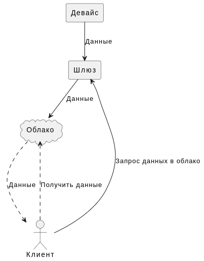
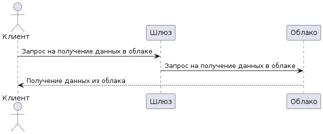
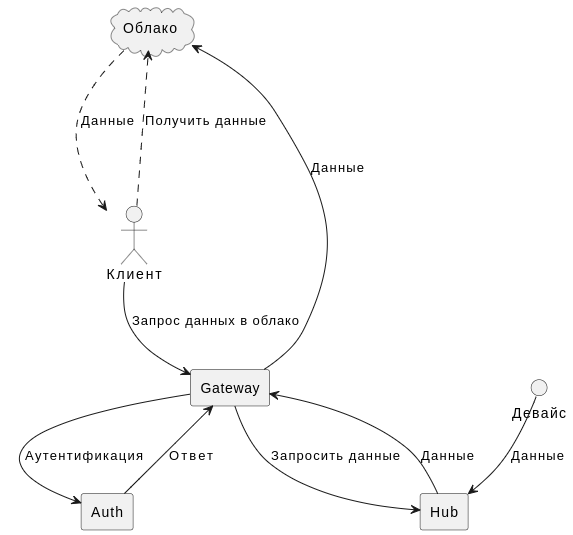
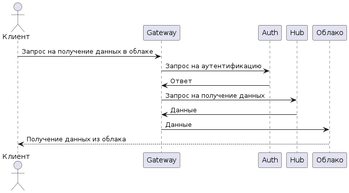

# artefacts
## КБП
### Краткое описание назначения и применения продукта
Продукт -- шлюз, который отправляет данные от некоторых устройств в облако для пользователя.  
#### Ценности продукта и негативные события в их отношении
| Ценность |Негативное событие | Величина ущерба | Комментарий |
|---------------------|---------------------|---------------------|---------------------|
| Девайс  |Поддельный девайс| Средний | В облако уйдут данные от нереального устройства |
| Облачное хранилище |Отправка данных в чужое облако| Высокий | Отправка данных производства в облако негодяев |
| Система шлюза | Подмена реальных данных устройства/устройств | Высокий |Пользователь может предпринять неверные решения на некорректных данных|
| Система шлюза | Полная поломка шлюза | Низкий |Событие заметное, будет сразу заметно, что был взлом|

### Роли пользователей
| Роль |Описание                        | 
|------|--------------------------------|
|Клиент|Непосредственный владелец данных|
|Клиент|Знает адрес нужного облака, может брать оттуда данные|
|Облако|Не имеет доступа к шлюзу|
|Облако|Получает данные от шлюза|
|Девайс|Не получает данные извне|
|Девайс|С некоторой периодичностью отправляет некоторую отчётность|

## Контекст

## Базовый сценарий

## Основные блоки шлюза
| Компонент |Описание                        | 
|-----------|--------------------------------|
|Auth|Выполняет аутентификацию устройств|
|Gateway|Получает запросы от клиента, получает данные от HUB,отправляет данные в облако|
|HUB|Получает данные от девайса, валидирует данные, кэширует данные до запроса клиента|

## Архитектура (HLA) v.0.01

## Базовый сценарий + HLA

