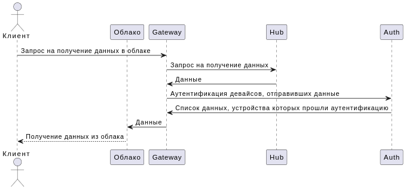

# artefacts
## КБП
### Краткое описание назначения и применения продукта
Продукт -- шлюз, который отправляет данные от некоторых устройств в облако для пользователя.  
#### Ценности продукта и негативные события в их отношении
| Ценность |Негативное событие | Величина ущерба | Комментарий |
|---------------------|---------------------|---------------------|---------------------|
| Облачное хранилище  |Поддельный девайс| Средний | В облако уйдут данные от нереального устройства |
| Девайс  |Поломка девайса| Низкий | Атака девайса извне |
| Система шлюза |Взлом шлюза и отправка данных в чужое облако| Высокий | Отправка данных производства в облако негодяев |
| Система шлюза | Подмена реальных данных устройства/устройств | Высокий |Пользователь может предпринять неверные решения на некорректных данных|
| Система шлюза | Полная поломка шлюза | Низкий |Событие заметное, будет сразу заметно, что был взлом|

### Роли пользователей
| Роль |Описание                        | 
|------|--------------------------------|
|Клиент|Непосредственный владелец данных|
|Клиент|Знает адрес нужного облака, может брать оттуда данные|
|Облако|Не имеет доступа к шлюзу|
|Облако|Получает данные от шлюза|
|Девайс|Не получает данные извне|
|Девайс|С некоторой периодичностью отправляет некоторую отчётность|

## Контекст

## Базовый сценарий

## Основные блоки шлюза
| Компонент |Описание                        | 
|-----------|--------------------------------|
|Auth|Выполняет аутентификацию устройств|
|Gateway|Получает запросы от клиента, получает данные от HUB,отправляет данные в облако, аутентифицирует клиента|
|HUB|Получает данные от девайса, валидирует данные, кэширует данные до запроса клиента|

## Архитектура (HLA) v.0.01

## Базовый сценарий + HLA

## ЦПБ
### Цели безопасности
1. В облако попадают данные только от аутентичных девайсов
2. В облако передаются только валидные данные
3. Данные передаются только в аутентичное и авторизованное облако
4. Шлюз обрабатывает только аутентичные запросы от авторизованных клиентов
### Предположения безопасности 
1. Девайсы благонадёжны

## Негативные сценарии
### Негативный сценарий 1. В облако передаются данные от неаутентичных девайсов.

Результат: недостижение цели безопасности 1 - в облаке присутствуют данные от неаутентичных девайсов
### Негативный сценарий 2. В облако передаются невалидные данные.

Результат: недостижение цели безопасности 2 - в облаке присутствуют невалидные данные.
### Негативный сценарий 3. Данные передаются в неаутентичное и неавторизованное облако

Результат: недостижение цели безопасности 3 - данные передаются в неаутентичное и неавторизованное облако, клиент может получить неверные данные или не получить их вовсе.
### Негативный сценарий 4. Шлюз обрабатывает неаутентичные запросы от неавторизованных клиентов

Результат: недостижение цели безопасности 4 - будут выполнены неаутентичные запросы от неавторизованных клиентов, данные могут быть скомпрометированны.

## Политика архитектуры

| Компонент |Описание                        | Сложность |Размер|
|-----------|--------------------------------|--|--|
|Auth|Выполняет аутентификацию устройств| S | S |
|Gateway|Получает запросы от клиента, получает данные от HUB,отправляет данные в облако, аутентифицирует клиента| L | XL |
|HUB|Получает данные от девайса, валидирует данные, кэширует данные до запроса клиента| M | M |

| Компонент | Статус |Комментарий                     | 
|-----------|--------------------------------|--|
|Auth|Доверенный| Нарушает цб 1 |
|Gateway|Повышает доверие| Нарушает цб 1, 3, 4 |
|HUB|Повышает доверие| Нарушает цб 2|

### Новая архитектура
| Компонент |Описание                        | Сложность |Размер|
|-----------|--------------------------------|--|--|
|DeviceAuth|Выполняет аутентификацию устройств| S | S |
|HUB|Получает данные от девайсов и передаёт в storage| S | S |
|Storage|Хранит последние данные девайсов| S | S |
|ManagerOutput|Валидирует данные, отправляет данные в облако| S | S |
|ClientAuth|Аутентификация клиентов| S | S |
|ManagerInput|Получает запрос от клиентов, валидирует полученные данные| S | S |

| Компонент | Статус |Комментарий                     | 
|-----------|--------------------------------|--|
|DeviceAuth|Доверенный| Нарушает цб 1 |
|ClientAuth|Доверенный| Нарушает цб 4 |
|ManagerInput|Повышает доверие| Нарушает цб 3, 4 |
|ManagerOutput|Повышает доверие| Нарушает цб 1, 2, 3|
|Hub|Недоверенный| |
|Storage|Недоверенный| |

#### Базовый сценарий

